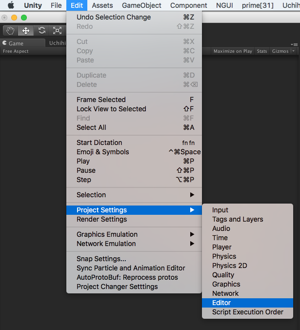
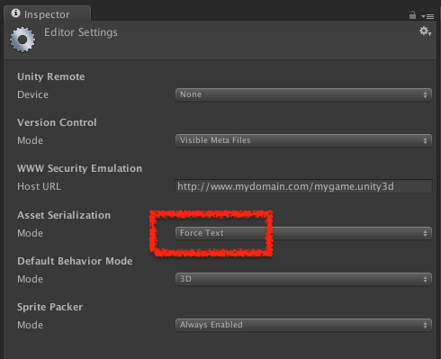

# LocateNotReferenced
「この画像はどこかで使ってるのかな？」  
「このマテリアルはどのprefabで使われてるんだろう？」  
といった時に探してくれるツールです。  
  
UnityのAssetでどこからも参照の無いAssetを見つける  
もしくは、とあるAssetがどこから参照されているかを見つける  

「Select DepenDensies」 の逆

### 使いかた
- Assetsフォルダ直下のEditorフォルダ(無い場合は作る)に2つのファイルを入れる。
	LocateNotReferenced.cs
	LocateNotReferenced.sh
- Unityメニュー > window > LocateNoDependencies
- project内で画像(jpg png tga等)、material、.prefab、.animationClip、.shaderのいずれか一つを選択する。
- search ボタンを押す。
- 検索結果がウインドウに表示されます。

### 動かない場合
- Unityメニュー > editor→project > settings→editor→Asset

 Serializationを force text にする。


- シェルスクリプトのパーミッションを変更
 動かない場合は、.shファイルのパーミッションを、変更します。
```command
$ chmod +x LocateNotReferenced.sh
```
- シェルのファイル置き場を変える場合、LocateNotReferenced.csの下記箇所のパスを変更します。
```C#
static readonly string SHELL_PATH = "/Editor/LocateNoDependencies/LocateNotReferenced.sh";
```
